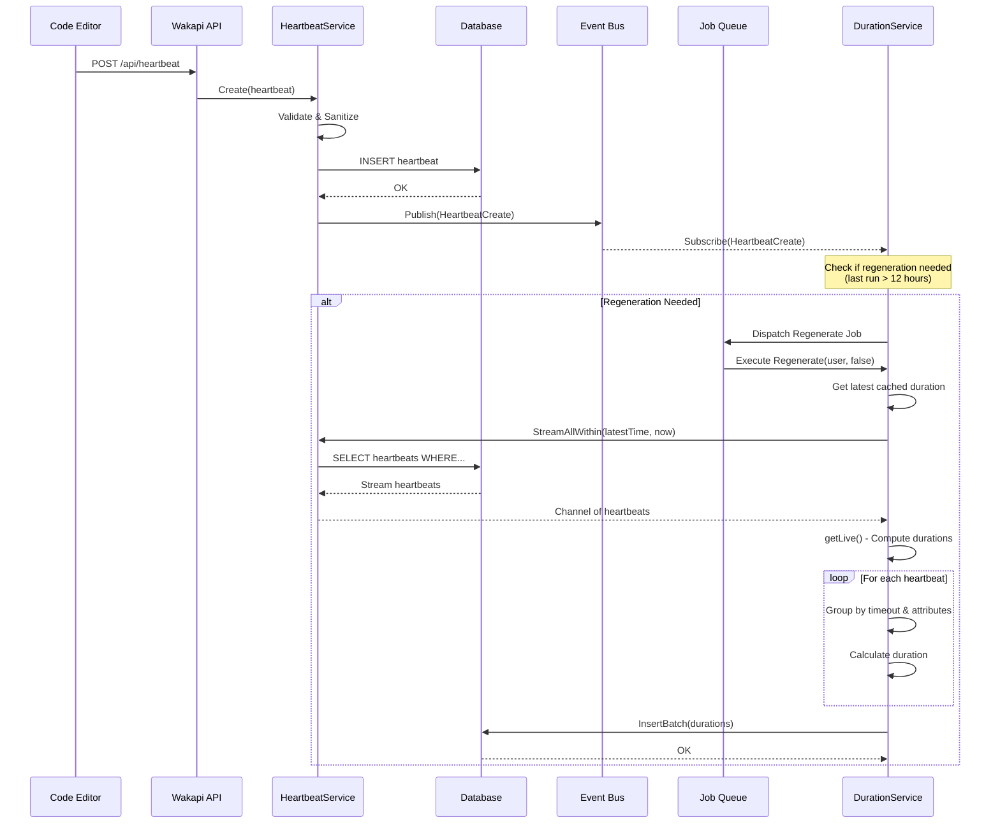
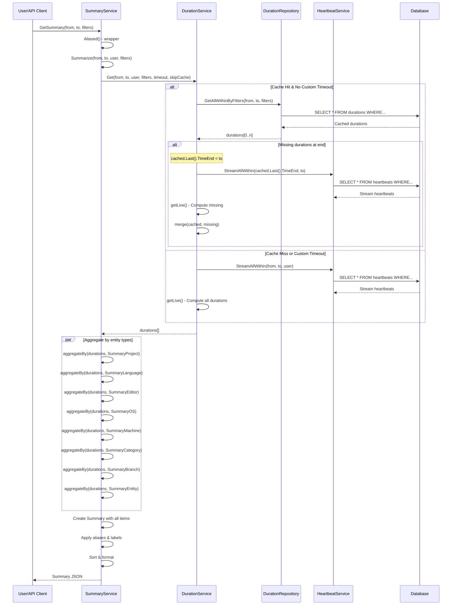
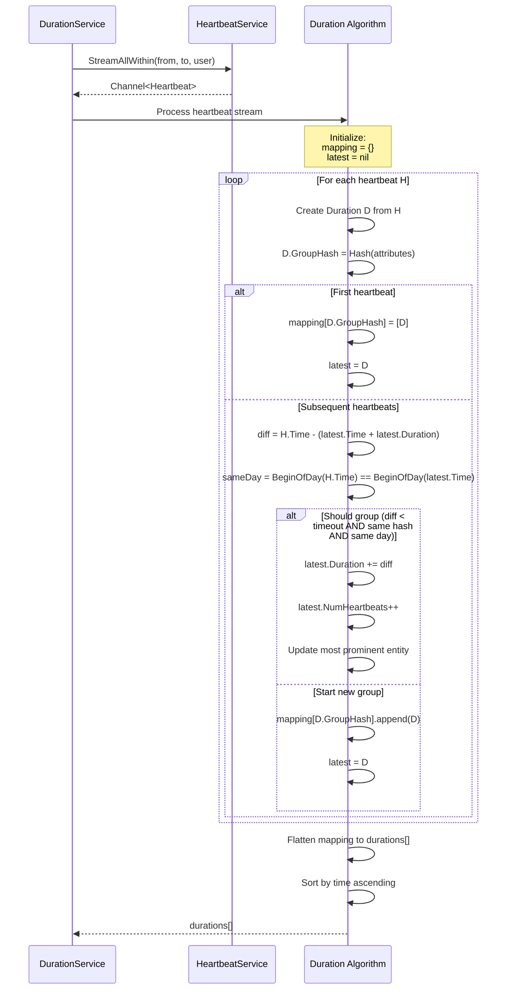
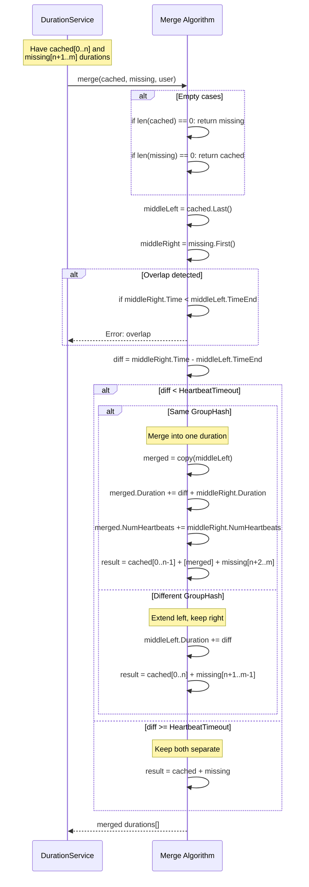
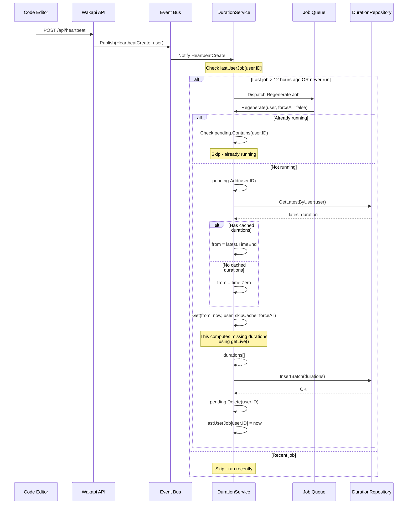
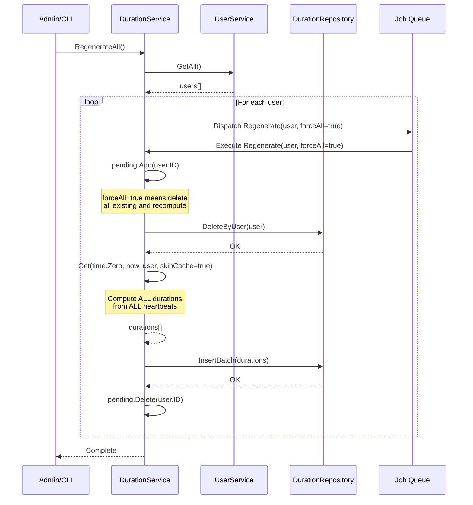

# Duration Module - Sequence Diagrams

This document contains sequence diagrams showing the flow of data through the Duration module.

## 1. Heartbeat to Duration Flow (Initial Computation)

## 2. Summary Generation from Durations

## 3. Duration Computation Details (getLive)

## 4. Duration Merging Process

## 5. Regeneration Triggered by Heartbeat

## 6. Full Regeneration (Admin Operation)

## Flow Summary

### Normal Operation
1. **Heartbeat arrives** → Stored in DB → Event published
2. **Event triggers check** → If 12+ hours since last regeneration → Queue job
3. **Background job runs** → Computes new durations from latest cached to now → Stores in DB

### Summary Request
1. **User requests summary** → DurationService.Get() called
2. **Check cache** → If complete, return cached + fill gaps
3. **Compute live** → If cache miss or custom timeout, compute from heartbeats
4. **Aggregate** → SummaryService groups durations by entity types
5. **Return result** → Formatted summary with all statistics

### Key Optimization Points
- **Caching**: Avoid recomputing from heartbeats every time
- **Incremental**: Only compute missing durations, not entire history
- **Streaming**: Process heartbeats in chunks, not loading all into memory
- **Parallel**: Aggregate summary types concurrently
- **Background**: Regeneration happens asynchronously, doesn't block API
